<div align="center">

# ◈ Repo-Assistant

### AI-Powered Repository Intelligence Platform

*Upload any GitHub repo. Understand it instantly.*


</div>

---

## What It Does
## Architecture


Repo Assistant turns any GitHub repository into an interactive intelligence dashboard. Instead of spending days reading through unfamiliar code, get instant answers about architecture, security risks, ownership patterns, and data flow.

**Ask questions like:**
- *"Where is authentication handled?"*
- *"Which files are riskiest to modify?"*
- *"What should a new developer read first?"*
- *"Who owns the payment module?"*
- *"What files always break together?"*

---

## Features

### V2 — Codebase Intelligence

| Feature | Description |
|---|---|
| **Semantic Q&A** | Chat with your codebase using RAG + cross-encoder reranking. Answers include exact file references and code evidence |
| **Auto Summary** | Instantly detects tech stack, architecture, and main features on upload |
| **Security Scanner** | 20+ rule-based checks — hardcoded secrets, SQL injection, missing .env, weak hashing |
| **Dependency Detection** | Identifies 50+ frameworks across frontend, backend, database, auth, and deployment |
| **Architecture Diagram** | Auto-generates Mermaid diagrams with actual filenames grouped by layer |
| **Onboarding Guide** | Day-by-day learning path for new developers with reading order and first tasks |
| **File Deep Explain** | Click any file for full breakdown — purpose, functions, dependencies, complexity |

### V3 — Git Intelligence *(requires GitHub URL)*

| Feature | Description |
|---|---|
| **Churn Analysis** | Which files change most often — high churn = higher bug probability |
| **Ownership Detection** | Who actually owns each file based on commit history |
| **Coupling Detection** | Files that always change together in the same commit |
| **Risk Ranking** | Combines churn + recency + coupling into calibrated risk scores |
| **Smart Reading Order** | Entry points and stable files recommended first for new developers |

---

## Tech Stack

```
Backend    FastAPI (Python 3.11)
LLM        Gemini 2.5 Flash
Embeddings sentence-transformers — all-MiniLM-L6-v2 (local, free)
Reranker   cross-encoder/ms-marco-MiniLM-L-6-v2
Vector DB  ChromaDB (persistent)
Git        GitPython
Auth       JWT + bcrypt
Frontend   React + Vite
Diagrams   Mermaid.js
```

---

## How the RAG Pipeline Works

```
Query expansion → Embedding → ChromaDB (top 20) → Cross-encoder reranking (top 5) → Gemini
```

Unlike basic RAG that sends top-N chunks by vector similarity, Code Intel adds a cross-encoder reranking step that scores each (question, chunk) pair together — dramatically reducing false positives.

---

## Setup

### Backend
```bash
cd backend
python -m venv venv
venv\Scripts\activate          # Windows
source venv/bin/activate       # Mac/Linux

pip install -r requirements.txt
cp .env.example .env
# Add GEMINI_API_KEY and JWT_SECRET_KEY to .env

uvicorn main:app --reload
```

### Frontend
```bash
cd frontend/frontend
npm install
npm run dev
```

Open `http://localhost:5173`

Get a free Gemini API key at [aistudio.google.com](https://aistudio.google.com)

---

## Usage

**V2 — ZIP Upload**
1. Download any GitHub repo as ZIP
2. Drop it in the upload zone
3. Click any feature card

**V3 — GitHub URL**
1. Paste: `https://github.com/user/repo`
2. Click Analyze
3. Git Intelligence tab unlocks automatically

---

## API Reference

| Method | Endpoint | Description |
|---|---|---|
| POST | `/upload` | Upload ZIP file |
| POST | `/upload/github` | Clone GitHub URL (V3) |
| POST | `/ask` | Q&A with chat history |
| GET | `/summary` | Repo summary |
| GET | `/security` | Security scan |
| GET | `/dependencies` | Tech stack |
| GET | `/diagram` | Architecture diagram |
| GET | `/onboard` | Onboarding guide |
| GET | `/git/risk` | Risk ranking |
| GET | `/git/churn` | Churn analysis |
| GET | `/git/ownership` | Ownership map |
| GET | `/git/coupling` | Coupling detection |

All analysis endpoints are **lazy-loaded** — generated on first request, cached in memory. Zero LLM calls on upload.

---

## Project Structure

```
repo-ai/
├── backend/
│   ├── main.py               # FastAPI routes
│   ├── chunker.py            # File-type specific chunking
│   ├── embedder.py           # Batch embedding
│   ├── retriever.py          # Hybrid search + reranking
│   ├── reranker.py           # Cross-encoder reranking
│   ├── store.py              # ChromaDB operations
│   ├── git_analyzer.py       # V3 git intelligence
│   ├── summarizer.py         # Auto summary
│   ├── security_scanner.py   # Security checks
│   ├── dependency_scanner.py # Framework detection
│   ├── architect.py          # Diagram generation
│   ├── onboarding.py         # Learning path
│   └── auth.py               # JWT authentication
│
└── frontend/frontend/
    └── src/
        ├── App.jsx           # Main app
        ├── AuthPage.jsx      # Login / register
        ├── ChatPanel.jsx     # Q&A interface
        ├── DiagramViewer.jsx # Mermaid renderer
        └── GitIntelPanel.jsx # Git intelligence UI
```

---

## What Makes It Different

Most AI code tools help you *write* code. This helps you *understand* it — especially useful when joining a new team or reviewing an unfamiliar codebase.

The git intelligence layer (V3) answers questions from source code alone — file ownership, coupling patterns, and risk ranking from actual commit history.

---

## License

MIT
